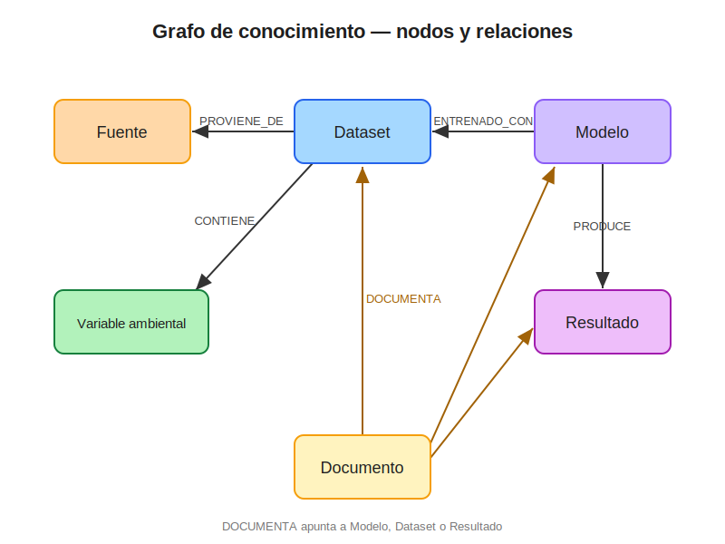
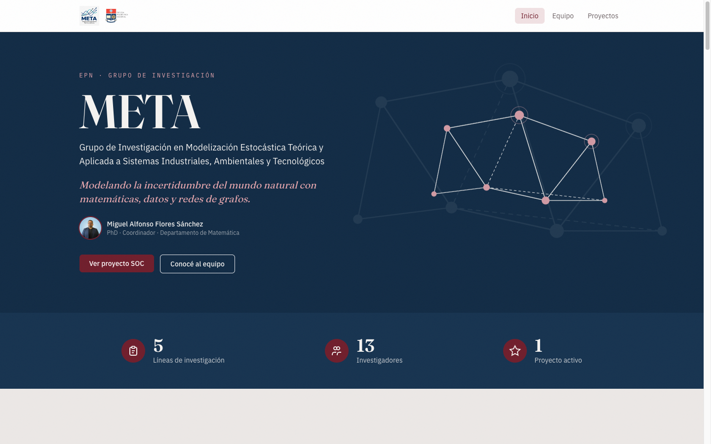
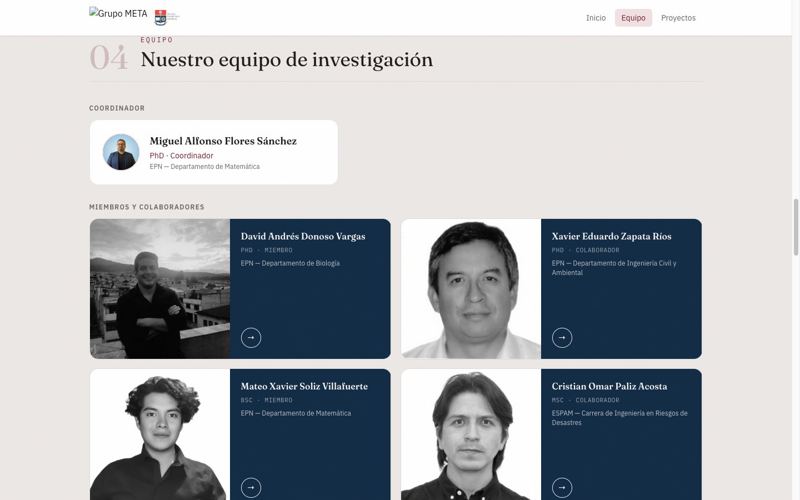
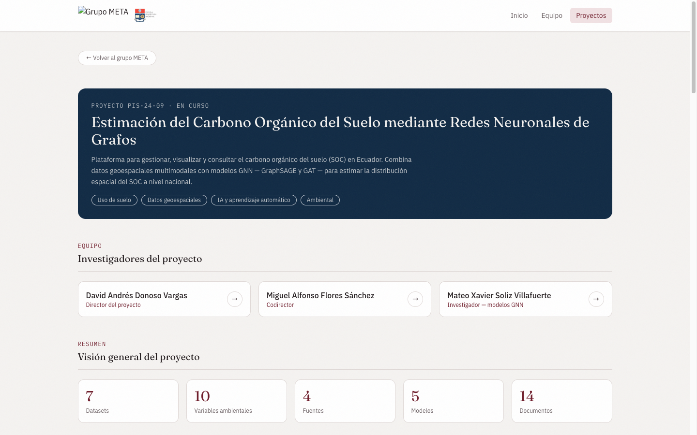
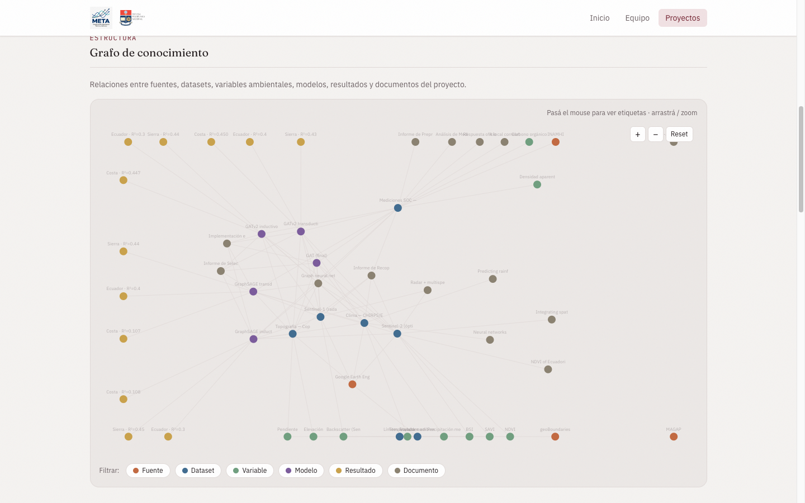
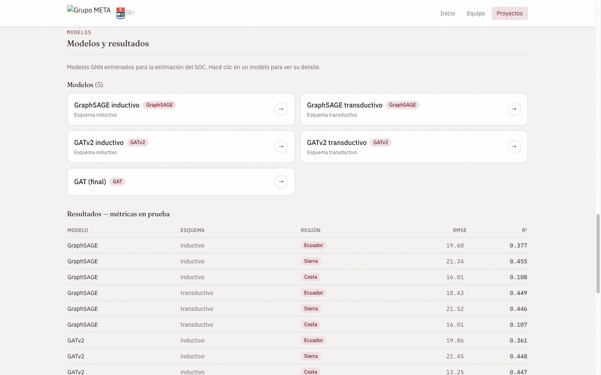

# Implementación de un Aplicativo Web para la Gestión de Información y Generación de un Grafo de Conocimiento — SOC

**Estimación del Carbono Orgánico del Suelo mediante Redes Neuronales de Grafos utilizando Datos Multimodales Geoespaciales**

> Informe técnico detallado — Producto 1 (PIS-24-09). Plantilla lista para completar
> y exportar a PDF. Los campos `[COMPLETAR: ...]` y `[INSERTAR CAPTURA: ...]` son lo
> único pendiente.

| | |
|---|---|
| **Director del proyecto** | David Andrés Donoso Vargas |
| **Profesional contratado** | Valentin Pico — Ingeniero de Software |
| **Fecha de entrega** | [COMPLETAR: fecha] |

---

## Tabla de contenido

1. Introducción
2. Objetivos
3. Metodología e implementación
4. Resultados
5. Conclusiones
6. Bibliografía
7. Anexos

---

## 1. Introducción

El presente informe describe el diseño e implementación de un aplicativo web para la
gestión de la información del Proyecto PIS-24-09, orientado a la estimación del Carbono
Orgánico del Suelo (SOC) en Ecuador. La iniciativa corresponde a la fase de
consolidación tecnológica del proyecto, en la cual los datos, modelos y resultados
generados en etapas previas —basadas en Redes Neuronales de Grafos (GNN) y datos
geoespaciales multimodales— requieren ser organizados, relacionados y puestos a
disposición de manera trazable y reproducible.

Para ello se desarrolló una plataforma web compuesta por un **repositorio digital** que
integra código, datos y documentación, y un **grafo de conocimiento soportado en base
de datos** que estructura y relaciona la información técnica del proyecto: datasets
geoespaciales, variables ambientales, modelos de aprendizaje automático, resultados de
desempeño, documentación técnica y fuentes de información.

A diferencia de un repositorio de archivos convencional, la plataforma modela
explícitamente las relaciones entre estos activos, lo que permite recorrer y consultar
la trazabilidad metodológica del proyecto (qué modelo se entrenó con qué datos, qué
documento describe qué resultado, de qué fuente proviene cada dataset) y sienta la base
para las fases posteriores de visualización (Fase 2) y de consulta inteligente basada
en RAG (Fase 3).

## 2. Objetivos

### Objetivo general

Diseñar e implementar un aplicativo web para la gestión de la información del proyecto
PIS-24-09, que integre un repositorio digital y un grafo de conocimiento soportado en
base de datos, garantizando la organización, trazabilidad y reproducibilidad de los
datos, modelos, resultados y documentación relacionados con la estimación del SOC en
Ecuador.

### Objetivos específicos

- Diseñar un modelo de datos que represente los activos del proyecto (fuentes,
  datasets, variables ambientales, modelos, resultados y documentos) y sus relaciones.
- Implementar un repositorio digital que integre código, datos y documentación, bajo
  criterios de organización, control de versiones, acceso y buenas prácticas de gestión
  de información.
- Generar un grafo de conocimiento soportado en base de datos que estructure y relacione
  la información técnica del proyecto.
- Desarrollar una interfaz web que permita consultar y gestionar la información
  catalogada y explorar el grafo de conocimiento.
- Establecer una infraestructura reproducible que sirva de base para las fases de
  visualización del SOC y de consulta inteligente (RAG).

## 3. Metodología e implementación

### 3.1 Arquitectura general

La plataforma se implementó como un **monorepo único** que integra, bajo un mismo control
de versiones, el backend, el frontend, las definiciones de base de datos y la
documentación. Esta decisión mantiene sincronizados el código y su documentación, permite
versionar de forma atómica un cambio que cruza varias capas (por ejemplo, un nuevo campo
que afecta a la API y a la interfaz) y simplifica el despliegue, que se realiza con un
único comando.

Todo el sistema se ejecuta en **contenedores orquestados con Docker Compose**, lo que
elimina la necesidad de instalar dependencias en el equipo anfitrión y garantiza que el
entorno sea idéntico en desarrollo y en evaluación. Se definieron cuatro servicios
reproducibles:

| Servicio | Rol |
|----------|-----|
| Frontend | Interfaz web (React + TypeScript) servida al navegador |
| API | Backend .NET 9 que expone la API REST |
| PostgreSQL + PostGIS | Base de datos relacional (fuente de verdad) |
| Neo4j | Base de datos de grafo (vista de relaciones) |

La pila tecnológica completa es la siguiente:

| Capa | Tecnología |
|------|-----------|
| Backend | .NET 9 (C#), ASP.NET Core |
| ORM | Entity Framework Core |
| Base de datos relacional | PostgreSQL + PostGIS |
| Grafo de conocimiento | Neo4j |
| Frontend | React + TypeScript + Vite + Tailwind CSS |
| Orquestación | Docker Compose |

En el backend se adoptó una **arquitectura por capas** con una dirección de dependencias
estricta:

- **Controlador:** recibe y valida la petición HTTP, delega en el servicio y traduce el
  resultado a una respuesta. No contiene lógica de negocio ni acceso a datos.
- **Servicio:** concentra la lógica de dominio y las reglas de negocio, y señala las
  condiciones de error mediante excepciones de dominio.
- **Repositorio / acceso a datos:** encapsula el acceso a las bases de datos a través de
  Entity Framework Core (relacional) y del driver de Neo4j (grafo).

Esta separación mantiene el SQL y la lógica de persistencia fuera de los controladores,
permite probar el servicio de forma aislada y facilita sustituir la capa de datos sin
afectar al resto del sistema.

En el frontend se aplicó una **arquitectura por features** (*vertical slices*): cada
funcionalidad agrupa sus componentes, hooks, llamadas a la API y tipos en su propia
carpeta. El estado global se gestiona con *stores* aislados y selectores granulares, el
manejo de errores se concentra en hooks de acciones (no en los componentes) y la interfaz
se construye sobre un conjunto de componentes compartidos reutilizables.


*Figura 1. Arquitectura de despliegue de la plataforma.*

### 3.2 Modelo de datos del repositorio

El repositorio se modeló mediante **seis entidades** relacionales y dos tablas de unión
inferidas por el ORM:

| Entidad | Atributos principales | Relaciones |
|---------|----------------------|-----------|
| `Fuente` | nombre, tipo, descripción, URL | 1..N `Dataset` |
| `Dataset` | nombre, tipo, cobertura temporal, puntero de ubicación, formato, n.º de registros | N..N `VariableAmbiental`, N..N `Modelo`, N..1 `Fuente` |
| `VariableAmbiental` | nombre, unidad, descripción | N..N `Dataset` |
| `Modelo` | nombre, arquitectura, esquema, *framework*, puntero de código | N..N `Dataset`, 1..N `Resultado` |
| `Resultado` | métricas de desempeño, descripción | N..1 `Modelo` |
| `Documento` | título, tipo, autores, fecha, ruta o DOI | documenta `Modelo`/`Dataset`/`Resultado` |

Las relaciones muchos-a-muchos (un modelo se entrena con varios datasets; un dataset
contiene varias variables) se materializan en las tablas de unión
`DatasetEnvironmentalVariable` y `DatasetModel`. El detalle del esquema se encuentra en
`docs/diagramas/modelo-datos.md`.

Una decisión central del diseño es que la plataforma **cataloga metadata y punteros, no
archivos pesados**: las imágenes satelitales (Sentinel-1/2, CHIRPS/ERA5, DEM) residen en
Google Earth Engine y se referencian mediante el identificador de su colección, mientras
que los datos livianos (mediciones de campo, métricas de resultados) se almacenan
directamente. Así se evita duplicar volúmenes de información geoespacial que ya están
versionados y disponibles en su fuente, y el catálogo se mantiene liviano y trazable.

PostgreSQL actúa como **fuente de verdad** relacional. Las categorías de catálogo (tipo de
fuente, tipo de dataset, arquitectura, esquema, tipo de documento) se modelan como cadenas
con convención explícita en lugar de enumeraciones rígidas, lo que privilegia la
flexibilidad ante la incorporación incremental de datos reales del proyecto.

### 3.3 Información catalogada

Se pobló el repositorio con la información real del proyecto:

- **Fuentes (4):** INAMHI, MAGAP, Google Earth Engine, geoBoundaries.
- **Datasets (7):** mediciones SOC MAGAP/INAMHI (12 861 perfiles, enfoque 0–30 cm);
  Sentinel-1 (radar); Sentinel-2 (óptico: NDVI, SAVI, BSI); clima CHIRPS/ERA5
  (precipitación y temperatura media 2021); topografía Copernicus DEM (elevación,
  pendiente); variables ambientales 2021 en raster a 30×30 m; límites provinciales del
  Ecuador.
- **Variables ambientales (10):** carbono orgánico, densidad aparente, backscatter,
  NDVI, SAVI, BSI, precipitación media, temperatura media, elevación, pendiente.
- **Modelos (5):** GraphSAGE y GATv2 en esquemas inductivo y transductivo, y GAT.
- **Resultados (12):** métricas en prueba (RMSE y R²) por modelo y región
  (Ecuador, Sierra, Costa).
- **Documentos (10):** informes técnicos firmados del PIS-24-09, oficio INAMHI y
  publicaciones científicas relacionadas con el SOC (incluida la del proyecto: *Graph
  neural networks for soil organic carbon estimation*, MLWA 2026), referenciadas por DOI
  o PDF local.

### 3.4 Grafo de conocimiento

El grafo de conocimiento se implementó en **Neo4j** y se obtiene por **proyección del
modelo relacional**: durante la carga inicial y la sincronización, cada entidad de
PostgreSQL se materializa como un nodo y cada relación entre entidades como una arista. Las
relaciones modeladas son:

```
(:Dataset)-[:PROVIENE_DE]->(:Fuente)
(:Dataset)-[:CONTIENE]->(:VariableAmbiental)
(:Modelo)-[:ENTRENADO_CON]->(:Dataset)
(:Modelo)-[:PRODUCE]->(:Resultado)
(:Documento)-[:DOCUMENTA]->(:Modelo | :Dataset | :Resultado)
```

El uso de **dos motores de base de datos** responde a una división de responsabilidades:
el modelo relacional garantiza la integridad referencial y resuelve con eficiencia las
consultas estructuradas (filtros, agregaciones, paginación), mientras que el grafo está
optimizado para **recorrer relaciones** —qué modelo se entrenó con qué datos, qué documento
describe qué resultado, de qué fuente proviene cada dataset— y para alimentar la
visualización interactiva.

El grafo integra de forma navegable la totalidad de los activos del proyecto y su
trazabilidad, y se **reconstruye automáticamente** ante cualquier alta, edición o baja en
el repositorio, de modo que refleja siempre el estado actual del catálogo sin intervención
manual.



*Figura 2. Nodos y relaciones del grafo de conocimiento.*

### 3.5 Repositorio digital y buenas prácticas

- **Código:** versionado en Git con commits atómicos siguiendo *Conventional Commits*, lo
  que produce un historial legible y trazable de cada cambio.
- **Datos:** organizados por tipo en `data/` (SOC, geo, modelos, documentos), de forma que
  cada activo se ubica por su naturaleza y no por la etapa en que se incorporó.
- **Documentación:** plan de fases, modelo de datos y convenciones técnicas en `docs/`,
  versionados junto al código.
- **Acceso y organización:** estructura de monorepo con convenciones de arquitectura y
  estilo documentadas en el repositorio, y separación estricta por capas (backend) y por
  *features* (frontend).

### 3.6 Interfaz web

Se desarrolló una interfaz con sistema de diseño propio —tokens semánticos con la
identidad institucional de la EPN (granate y azul), tipografía editorial y textura
sutil—, construida con arquitectura por *features* y componentes compartidos
reutilizables (`Button`, `Input`, `Select`, `Modal`, `ConfirmModal`, `Badge`). La
plataforma es una única aplicación de navegación clara:

- **Página principal — Grupo de Investigación META:** presenta al grupo (nombre,
  acrónimo, coordinador y EPN), sus cinco líneas de investigación agrupadas por
  departamento, los ámbitos de interés, el equipo de investigación y los proyectos.
- **Perfil de investigador:** por cada integrante muestra su adscripción, correo
  institucional, líneas asociadas, una reseña, su **experiencia en proyectos**, el
  listado de **publicaciones** (clasificadas por área y enlazadas a su DOI) y un
  **grafo de conocimiento individual** que relaciona sus áreas de investigación según
  la co-ocurrencia de temas en sus publicaciones.
- **Investigaciones por área:** la producción científica del equipo, clasificada
  automáticamente en doce áreas temáticas; al seleccionar un área se listan las
  investigaciones relacionadas y sus autores.
- **Proyecto SOC (PIS-24-09):** página única que reúne, sin pestañas, una visión
  general con indicadores (datasets, variables, fuentes, modelos y documentos), el
  **grafo de conocimiento del proyecto** —con filtro por tipo de nodo, desplazamiento
  y zoom—, los datos (datasets, variables ambientales y fuentes), los modelos GNN con
  sus métricas de desempeño, y los documentos descargables.

### 3.7 Seguridad y administración

La plataforma se publica en **modo lectura**: la consulta del catálogo y del grafo es
pública y no requiere autenticación, mientras que toda operación de escritura está
restringida. La capa de edición (altas, ediciones, bajas y carga de archivos) reside en el
backend y se protege con un esquema verificado **del lado del servidor**:

- Toda operación de mutación (`POST`/`PUT`/`DELETE`) exige una contraseña transmitida en
  una cabecera HTTP; el servidor la valida y rechaza la petición con `401 Unauthorized` si
  no es correcta.
- La verificación ocurre en el servidor, de modo que la interfaz no expone la credencial
  ni delega la decisión de autorización al cliente.
- Las operaciones de lectura (`GET`) quedan libres, lo que permite difundir la plataforma
  sin comprometer la integridad del catálogo.

Los **errores de dominio** se mapean de forma centralizada a respuestas HTTP coherentes
mediante un manejador global: las excepciones de "no encontrado", "validación",
"conflicto" y "no autorizado" se traducen a sus códigos correspondientes (`404`, `400`,
`409`, `401`), lo que evita filtrar detalles internos y mantiene un contrato de error
uniforme en toda la API.

### 3.8 Pruebas (TDD)

El proyecto adopta **desarrollo guiado por pruebas (TDD)** bajo el ciclo *rojo → verde →
refactor*: primero se escribe una prueba que falla, luego el código mínimo que la satisface
y finalmente se refactoriza con la red de seguridad de las pruebas. Toda lógica de negocio
nueva se acompaña de su prueba. Existen dos suites que se ejecutan en contenedor:

- **Backend (xUnit + EF Core InMemory):** validan las reglas de dominio del servicio de
  catálogo —campos obligatorios, referencia a una fuente inexistente, recursos no
  encontrados— para datasets, documentos, fuentes, variables y modelos. Se emplea una base
  de datos en memoria y dobles de prueba (por ejemplo, un doble del servicio de grafo) para
  aislar la lógica del servicio del acceso real a datos.
- **Frontend (Vitest + Testing Library):** validan la utilidad de construcción de enlaces,
  el cálculo del *layout* del grafo (cantidad de nodos, límites y determinismo del
  resultado) y los hooks de acciones, comprobando que devuelven un resultado booleano y que
  **nunca lanzan** excepciones hacia los componentes.

Las pruebas son rápidas y no dependen de servicios externos, por lo que se ejecutan de
forma continua durante el desarrollo.

### 3.9 Validación operativa

El entorno completo se levanta con un único comando (`docker compose up`) y expone una API
REST verificada (endpoints de catálogo y de grafo) junto con una interfaz funcional. Se
comprobaron las operaciones de consulta y de gestión, la generación del grafo y la
**correspondencia entre el modelo relacional y el grafo de conocimiento**, confirmando que
ambas vistas describen el mismo conjunto de activos y relaciones.

### 3.10 Proceso de desarrollo

El desarrollo siguió un proceso iterativo e incremental, íntegramente en contenedores:

- **Monorepo único** (backend, frontend, datos, documentación) bajo control de versiones
  Git con *Conventional Commits* atómicos.
- **Infraestructura como código** con Docker Compose: cuatro servicios reproducibles,
  levantables con un único comando, sin instalaciones en el equipo anfitrión.
- **Arquitectura por capas** en el backend (controlador → servicio → acceso a datos) y
  **por features** en el frontend, con componentes compartidos reutilizables.
- **TDD (test primero)** para la lógica de negocio; verificación continua de la API y de
  la interfaz.
- **Decisiones técnicas documentadas:** PostgreSQL como fuente de verdad y Neo4j como
  vista de grafo; catálogo de metadatos con punteros en lugar de almacenar datos pesados;
  modo lectura por defecto con administración protegida por contraseña.
- Datos reales del proyecto incorporados de forma incremental y reorganizados por tipo.

## 4. Resultados

El resultado del Producto 1 es una plataforma web funcional, desplegada y operativa, que
materializa el repositorio digital y el grafo de conocimiento descritos. A continuación se
presentan sus vistas principales y la función de cada una.

### 4.1 Página principal del Grupo de Investigación META



*Figura 3. Página principal (landing) del Grupo META.*

La página principal es el punto de entrada público de la plataforma. Presenta la identidad
del grupo de investigación META (Modelización Estocástica Teórica y Aplicada) de la EPN
—acrónimo, tagline y coordinador— y un resumen cuantitativo del grupo: líneas de
investigación, número de investigadores y proyectos activos. Desde aquí se accede al
proyecto SOC y al equipo.

### 4.2 Equipo de investigación



*Figura 4. Sección de equipo de investigación.*

Esta sección lista al coordinador y a los integrantes y colaboradores del grupo. Cada
tarjeta enlaza al perfil individual del investigador, donde se muestran su adscripción,
correo institucional, líneas asociadas, una reseña, su experiencia en proyectos, sus
publicaciones y un grafo de conocimiento personal construido a partir de la co-ocurrencia
de temas en sus publicaciones.

### 4.3 Proyecto SOC — visión general e indicadores



*Figura 5. Página del proyecto SOC: equipo del proyecto e indicadores.*

La página del proyecto SOC (PIS-24-09) reúne en una sola vista al equipo del proyecto y un
panel de indicadores del catálogo: cantidad de datasets, variables ambientales, fuentes,
modelos y documentos registrados. Ofrece una lectura inmediata del alcance de la
información catalogada y da acceso al grafo de conocimiento, a los datos y a los documentos
descargables.

### 4.4 Proyecto SOC — grafo de conocimiento



*Figura 6. Grafo de conocimiento del proyecto SOC.*

El grafo de conocimiento integra de forma navegable la totalidad de los activos del
proyecto y sus relaciones. Cada nodo representa una entidad (fuente, dataset, variable
ambiental, modelo, resultado o documento) y cada arista, una relación de trazabilidad —de
qué fuente proviene un dataset, con qué datos se entrenó un modelo, qué documento describe
qué resultado—. La vista permite filtrar por tipo de nodo, desplazarse y hacer zoom.

### 4.5 Proyecto SOC — modelos y resultados



*Figura 7. Modelos GNN catalogados y tabla de métricas de desempeño.*

Esta sección cataloga los modelos de redes neuronales de grafos (GraphSAGE, GAT y GATv2,
en esquemas inductivo y transductivo) y su desempeño en prueba (RMSE y R²) por región.
Permite comparar las arquitecturas y constituye la evidencia cuantitativa del trabajo de
modelización integrado en la plataforma.

## 5. Conclusiones

- La implementación de un repositorio digital y un grafo de conocimiento permite
  centralizar, organizar y **relacionar de forma trazable** los activos heterogéneos del
  proyecto (datos geoespaciales, variables, modelos, resultados y documentación),
  facilitando su consulta y reutilización.
- La arquitectura por capas y la ejecución en contenedores garantizan
  **reproducibilidad, escalabilidad y mantenibilidad**, y constituyen una base sólida
  para las fases posteriores del proyecto.
- El grafo de conocimiento, al modelar explícitamente las relaciones entre datos,
  modelos, resultados y documentación, aporta **trazabilidad metodológica** y se
  proyecta como insumo directo para el sistema de recuperación de información (RAG)
  previsto en la Fase 3.
- La catalogación de la información real del proyecto (incluidas las métricas de
  desempeño de los modelos GNN) demuestra la utilidad práctica de la plataforma como
  herramienta de gestión y transferencia del conocimiento generado.
- [COMPLETAR: conclusión adicional propia, si corresponde]

## 6. Bibliografía

- Instituto Nacional de Meteorología e Hidrología (INAMHI). (2021). *Base de datos de
  mediciones de Carbono Orgánico del Suelo del Ecuador continental*, proporcionada a
  través del Ministerio de Agricultura y Ganadería (MAGAP).
- Soliz Villafuerte, M. X., & Donoso Vargas, D. A. (2026). *Informe de Implementación en
  Python de la Arquitectura Óptima de Red Neuronal Profunda para la Estimación y
  Predicción del SOC* (Producto 2 del Proyecto PIS-24-09). Escuela Politécnica Nacional.
- Soliz Villafuerte, M. X., & Donoso Vargas, D. A. (2026). *Informe sobre la Capacidad
  de los Modelos para Capturar la Dinámica de los Niveles de Carbono Orgánico en los
  Suelos de Ecuador* (Proyecto PIS-24-09). Escuela Politécnica Nacional.
- [COMPLETAR: otras referencias]

## 7. Anexos

### Anexo 1 — Diagramas de arquitectura

- **Figura 1 — Arquitectura de despliegue:** `docs/diagramas/arquitectura-despliegue.svg`
  (ver sección 3.1).
- **Figura 2 — Grafo de conocimiento:** `docs/diagramas/grafo-conocimiento.svg`
  (ver sección 3.4).

### Anexo 2 — Repositorio y despliegue

- **Código fuente (GitHub):** https://github.com/Valentinpico/plataforma-soc
- **Ejecución / despliegue:** entorno reproducible con Docker Compose; la plataforma se
  levanta localmente con un único comando (`docker compose up`), que inicia los cuatro
  servicios (frontend, API, PostgreSQL y Neo4j).

### Anexo 3 — Métricas de desempeño catalogadas (RMSE y R² en prueba)

| Modelo | Esquema | Región | RMSE | R² |
|--------|---------|--------|------|-----|
| GATv2 | transductivo | Ecuador | 18.18 | 0.465 |
| GraphSAGE | transductivo | Ecuador | 18.43 | 0.449 |
| GATv2 | inductivo | Ecuador | 19.86 | 0.361 |
| GraphSAGE | inductivo | Ecuador | 19.60 | 0.377 |
| GraphSAGE | inductivo | Sierra | 21.34 | 0.455 |
| GATv2 | inductivo | Sierra | 21.45 | 0.448 |
| GraphSAGE | transductivo | Sierra | 21.52 | 0.446 |
| GATv2 | transductivo | Sierra | 21.61 | 0.439 |
| GATv2 | transductivo | Costa | 13.22 | 0.450 |
| GATv2 | inductivo | Costa | 13.25 | 0.447 |
| GraphSAGE | inductivo | Costa | 16.01 | 0.108 |
| GraphSAGE | transductivo | Costa | 16.01 | 0.107 |

Fuente: *Informe sobre la Capacidad de los Modelos* (Tablas 4–9).
